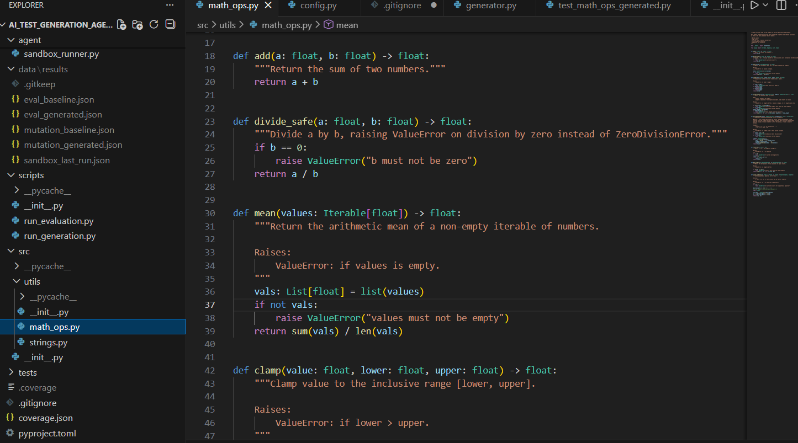
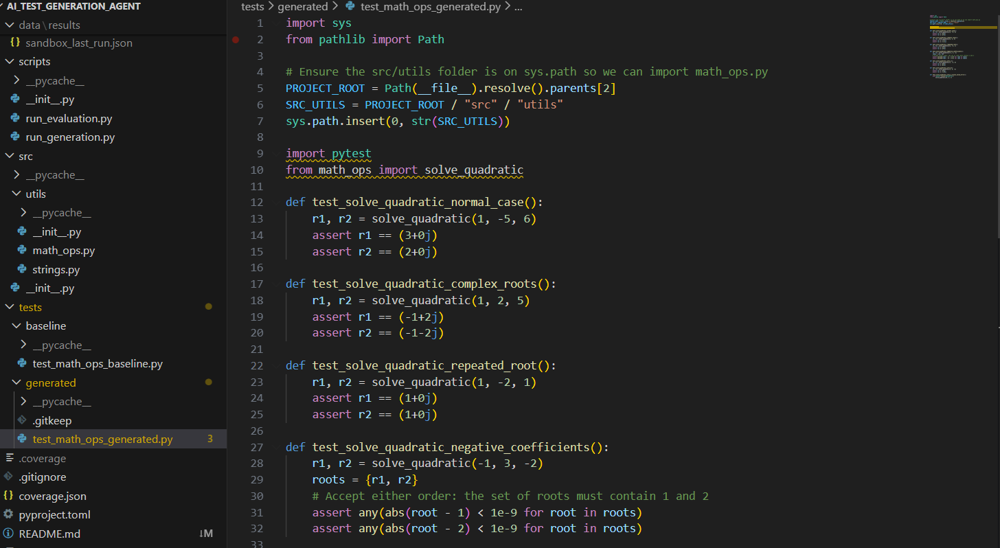
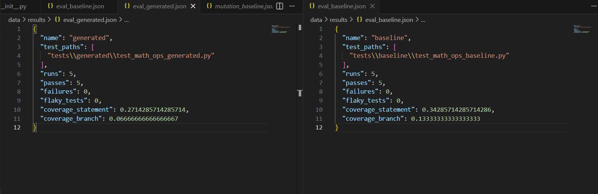

# AI-Driven Test Generation Agent (Gemini-based Skeleton)

This project is a **minimal scaffold** for evaluating an AI-driven test-generation agent
that uses a LLM model (e.g. Google Gemini) to generate `pytest` tests for a Python module, and
then evaluates them using coverage, mutation testing, and flakiness metrics.

## High-Level Flow

1. You provide a Python module, e.g. `src/utils/math_ops.py`.
2. The **agent** discovers functions in the module using `ast`.
3. For each function, it sends a prompt to the **Gemini API** asking for
   `pytest` tests.
4. The generated tests are written to `tests/generated/test_<module>_gen.py`.
5. The **sandbox runner** executes the tests with timeouts and basic safety checks (forbidden imports, etc.).
6. The **evaluation harness** computes:
   - Test pass/fail statistics
   - Coverage (statement/branch) using `coverage.py`
   - Flakiness (by running tests multiple times)
   - (Optional) Mutation score using `mutmut` or a similar tool
7. Metrics and safety violations are written to `data/results/*.json` for later analysis.


---
## Screenshots

**Input module**



**Baseline tests**


**AI-generated tests**



**Evaluation metrics**



---

## Setup

```bash
# Create and activate a virtual environment (recommended)
python -m venv .venv
source .venv/bin/activate  # On Windows: .venv\Scripts\activate

# Install dependencies
pip install -r requirements.txt
```

Set your Gemini API key as an environment variable:

```bash
export GEMINI_API_KEY="YOUR_KEY_HERE"   # On Windows: set GEMINI_API_KEY=YOUR_KEY_HERE
```

> If the key is missing or the `google-generativeai` package is not installed,
> the agent will fall back to a **dummy generator** that creates very simple tests.
> This is useful for offline development and debugging.

---

## Example Usage

### 1. Generate tests for a module

```bash
python -m scripts.run_generation src/utils/math_ops.py
```

This will:

- Discover functions in `math_ops.py`
- Call the Gemini-based agent
- Write generated tests to `tests/generated/test_math_ops_generated.py`
- Log basic safety/violation info to `data/results/generation_log.jsonl`

### 2. Run evaluation (baseline vs generated)

Make sure you have at least one baseline test file in `tests/baseline/`, e.g.:

- `tests/baseline/test_math_ops_baseline.py`

Then run:

```bash
python -m scripts.run_evaluation
```

This will:

- Run `pytest` with coverage for:
  - Baseline tests
  - Generated tests
- Run each suite multiple times to estimate flakiness
- Optionally run mutation testing (if `mutmut` is installed)
- Write JSON metrics into `data/results/eval_baseline.json` and `data/results/eval_generated.json`.

---

## Project Structure

```text
ai_test_generation_agent/
  README.md
  requirements.txt
  pyproject.toml          # optional, for modern tooling
  src/
    utils/
      __init__.py
      math_ops.py
      strings.py
  tests/
    baseline/
      test_math_ops_baseline.py
    generated/
      .gitkeep
  agent/
    __init__.py
    config.py
    prompt_templates.py
    generator.py
    sandbox_runner.py
    evaluation.py
    mutation.py
  scripts/
    __init__.py
    run_generation.py
    run_evaluation.py
  data/
    results/
      .gitkeep
```

---


- You can **swap Gemini** for any other small model (local or external) by editing `agent/generator.py`.
- Extend `agent/mutation.py` if you want deeper mutation testing (multiple operators, per-function reports).
- Use the JSON files produced in `data/results/` as the basis for your **plots, tables, and statistical analysis**.
- For safety/violation logging, check `agent/sandbox_runner.py` and extend the list of forbidden APIs.

This scaffold is intentionally minimal but captures the **end-to-end flow** you described in your thesis-aligned project.
